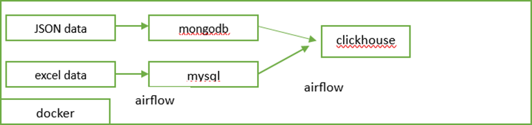
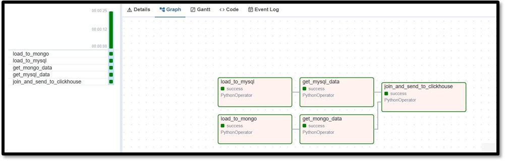
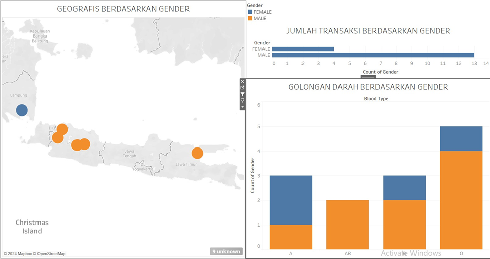
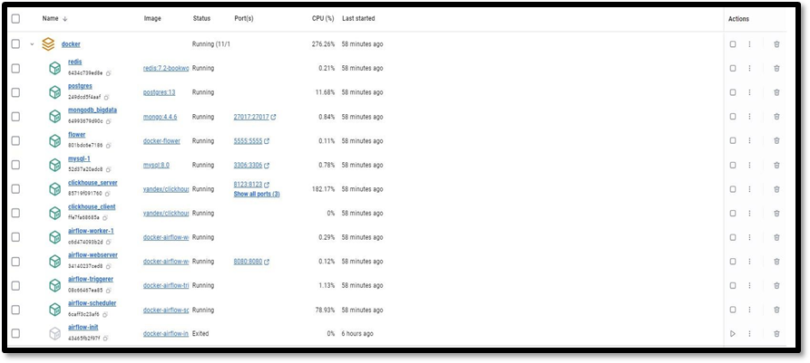
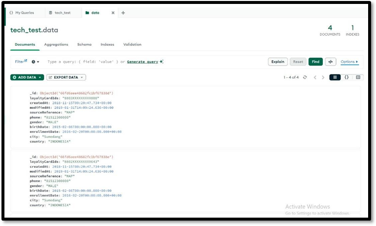
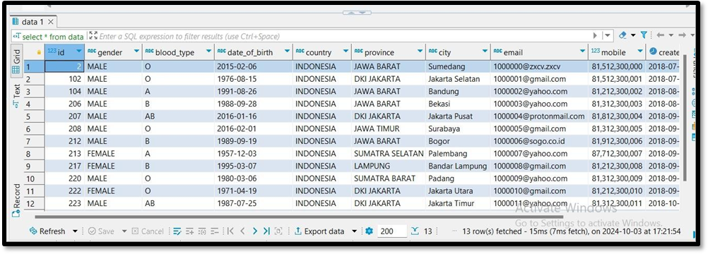
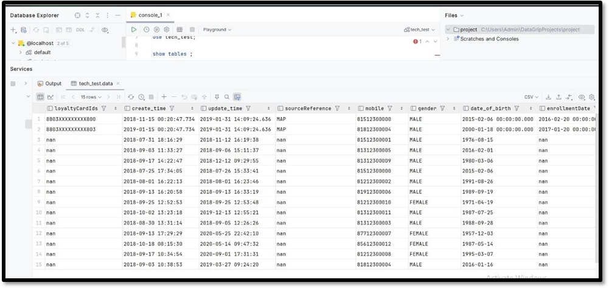
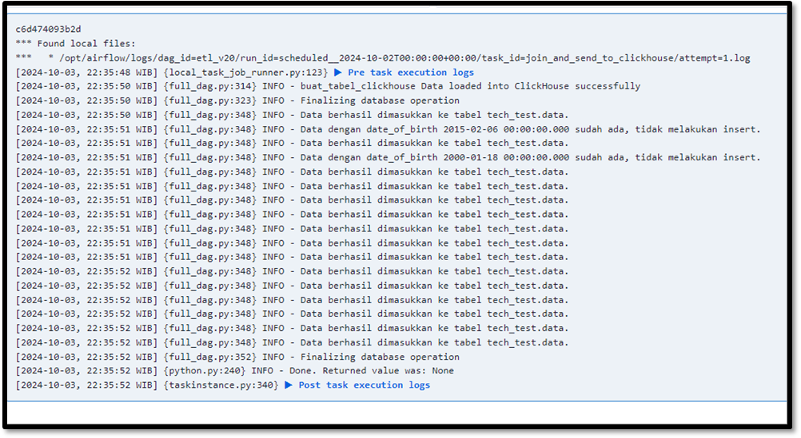

# ETL Pipeline and Data Visualization Project

**Project Context:** Data Engineering Technical Assessment — GTech Digital Asia

---

## 1. Technology Stack

### 1.1 Docker

Docker was selected as the containerization platform to ensure consistent, reproducible environments across development and deployment. All infrastructure components — including the Dockerfile, Docker Compose configuration, and startup scripts — are provided as part of this project.

Key advantages of this approach:

- **Environment Isolation:** Eliminates dependency conflicts by encapsulating each service within its own container.
- **Portability:** Enables seamless migration across environments without manual reconfiguration.
- **Resource Efficiency:** Containers operate with significantly lower overhead compared to traditional virtual machines.

### 1.2 MongoDB

MongoDB served as the OLTP database for semi-structured data. Given that one of the source datasets was in JSON format, MongoDB's document-oriented architecture was the natural fit for ingesting and storing this data.

### 1.3 MySQL

MySQL served as the OLTP database for structured, tabular data. The spreadsheet-formatted source dataset (`.xlsx`) mapped directly to a relational schema, making MySQL the appropriate choice.

### 1.4 Python

Python was the primary programming language for this pipeline, leveraging the following libraries:

- `pymongo` — MongoDB connectivity
- `pymysql` — MySQL connectivity
- `clickhouse_driver` — ClickHouse connectivity
- `pandas` — data manipulation and transformation
- `requests` — HTTP-based data retrieval
- `openpyxl` — Excel file parsing

All ETL logic was implemented as an Apache Airflow DAG, with the complete source code included in this repository.

### 1.5 Apache Airflow

Apache Airflow was chosen as the orchestration platform. The batch-processing nature of this pipeline aligns well with Airflow's scheduling and dependency management capabilities. As an open-source tool, it also provides a cost-effective solution without vendor lock-in.

### 1.6 ClickHouse

ClickHouse was selected as the OLAP data warehouse due to its columnar storage architecture and high-performance analytical query engine. These characteristics make it well-suited for serving aggregated data to downstream visualization tools such as Tableau.

---

## 2. Project Architecture and Code Walkthrough

This section provides a detailed explanation of how the ETL pipeline is constructed and how each component interacts. The project follows a standard **OLTP → ETL → OLAP** pattern: raw transactional data is ingested into two operational databases (MongoDB for JSON data and MySQL for spreadsheet data), then extracted, cleaned, merged, and loaded into ClickHouse as the analytical data warehouse. The entire workflow is orchestrated by an Apache Airflow DAG (`full_dag.py`), with all services running inside Docker containers defined in the `Dockerfile` and `docker-compose.yaml`.

### 2.1 End-to-End Data Flow

The pipeline processes data through the following stages:

1. **Source 1 (JSON):** A JSON dataset is retrieved from GitHub, cleaned, and persisted to MongoDB (the OLTP store for semi-structured data).
2. **Source 2 (XLSX):** An Excel dataset is retrieved from GitHub and persisted to MySQL (the OLTP store for relational data).
3. **Extract:** Data is read from both MongoDB and MySQL into Pandas DataFrames.
4. **Transform:** Both DataFrames are aligned through column renaming and merged via a full outer join, combining records from both sources into a unified table.
5. **Load:** The merged result is written to ClickHouse (the OLAP data warehouse) for analytical queries and Tableau visualization.

```
GitHub (JSON / XLSX)  →  MongoDB / MySQL (OLTP)  →  Pandas Merge  →  ClickHouse (OLAP)  →  Tableau Dashboard
```

*Figure 1 — High-level architecture diagram:*



### 2.2 Dockerfile

The Dockerfile builds a custom Airflow image based on `apache/airflow:2.10.1`, pre-installed with all system dependencies and Python libraries required by the DAG. This ensures the pipeline executes identically on any host machine.

```dockerfile
FROM apache/airflow:2.10.1

USER root
RUN apt-get update && apt-get install -y --no-install-recommends \
    gcc python3-dev build-essential libsasl2-dev libldap2-dev libssl-dev \
    krb5-user libkrb5-dev iputils-ping curl net-tools wget telnet libpq-dev nano && \
    curl -fsSL https://get.docker.com | sh && \
    rm -rf /var/lib/apt/lists/*
RUN usermod -aG docker airflow
RUN mkdir -p /dev/net && mknod /dev/net/tun c 10 200 && chmod 600 /dev/net/tun

USER airflow
RUN pip install pandas requests pymongo clickhouse_driver pymysql \
    psycopg2-binary openpyxl pyarrow redis ...  # (and Airflow providers)
RUN pip install apache-airflow-providers-postgres
RUN airflow db upgrade
```

**Line-by-line breakdown:**

- `FROM apache/airflow:2.10.1` — Uses the official Apache Airflow 2.10.1 image as the base layer.
- `USER root` — Temporarily elevates to root for system-level package installation.
- `apt-get install ...` — Installs build toolchains (`gcc`, `python3-dev`, `build-essential`), authentication libraries (`libsasl2-dev`, `libldap2-dev`, `libssl-dev`, `krb5-user`, `libkrb5-dev`), the PostgreSQL client library (`libpq-dev`), and network utilities (`ping`, `curl`, `net-tools`, `wget`, `telnet`, `nano`).
- `curl ... get.docker.com | sh` — Installs Docker inside the container to enable `DockerOperator` tasks. The subsequent `usermod -aG docker airflow` grants the `airflow` user access to the Docker socket.
- `mknod /dev/net/tun` — Creates the TUN device for VPN/tunnel scenarios (optional).
- `USER airflow` — Reverts to the non-root `airflow` user, following the principle of least privilege.
- `pip install ...` — Installs all Python dependencies: `pandas` (data manipulation), `requests` (HTTP downloads), `pymongo` (MongoDB driver), `clickhouse_driver` (ClickHouse driver), `pymysql` and `psycopg2-binary` (MySQL and PostgreSQL drivers), `openpyxl` (Excel parsing), `redis`, `pyarrow`, and Airflow provider packages.
- `providers-postgres` / `airflow db upgrade` — Adds the PostgreSQL provider for Airflow's metadata backend and applies database schema migrations.

### 2.3 Docker Compose Configuration

The `docker-compose.yaml` defines and orchestrates all platform services. It uses the standard Airflow **CeleryExecutor** topology and adds the project-specific databases (MongoDB, MySQL, and ClickHouse). All services communicate over a shared Docker network.

**Shared configuration (`x-airflow-common`):** A YAML anchor containing settings reused across all Airflow services:

- `EXECUTOR: CeleryExecutor` — Distributes tasks to Celery workers for parallel, scalable execution.
- `SQL_ALCHEMY_CONN → PostgreSQL` — Airflow persists its internal state (DAGs, task instances, run metadata) in PostgreSQL.
- `CELERY broker → Redis` — Redis serves as the Celery message broker.
- `TZ` / `volumes` — Timezone is set to `Asia/Jakarta`; local directories (`dags/`, `logs/`, `plugins/`, `output/`) and the Docker socket are bind-mounted into the containers.

**Service definitions:**

| Service | Description |
|---|---|
| `postgres` | PostgreSQL 13 — Airflow metadata database |
| `redis` | Redis 7.2 — Celery message broker |
| `airflow-webserver` | Airflow web UI (port `8080`) |
| `airflow-scheduler` | DAG scheduling and task triggering |
| `airflow-worker-1` | Celery worker for task execution |
| `airflow-triggerer` | Handles deferrable/asynchronous tasks |
| `airflow-init` | One-time initialization: schema migration and default admin user creation (`airflow`/`airflow`) |
| `airflow-cli` / `flower` | Optional: CLI access and Flower monitoring UI (port `5555`), enabled via Docker Compose profiles |
| `clickhouse_server` / `clickhouse_client` | ClickHouse OLAP data warehouse (ports `8123` HTTP, `9000` native) with a persistent client container |
| `mongo` | MongoDB 4.4.6 — OLTP store for JSON data (container: `mongodb_bigdata`, port `27017`) |
| `mysql` | MySQL 8.0 — OLTP store for XLSX data (port `3306`) |

**Networking:** All services join an external Docker network named `tech_test`, enabling inter-service communication by container name (e.g., `mongodb_bigdata`, `clickhouse_server`). This network must be created before first launch:

```bash
docker network create tech_test
```

**Startup script (`run_airflow.sh`):** Automates the launch sequence — rebuilds images from scratch (`docker compose build --no-cache`), starts all services in detached mode (`docker compose up -d`), and optionally starts the Flower monitoring UI.

---

## 3. ETL Pipeline — DAG Walkthrough (`full_dag.py`)

`full_dag.py` is the Apache Airflow DAG that orchestrates the entire ETL process. It consists of **five tasks** connected in a pipeline topology. This section describes the DAG configuration and each task in execution order.

### 3.1 DAG Configuration

```python
dag = DAG(
    'etl',
    default_args=default_args,          # owner='airflow', start_date=days_ago(1)
    description='ETL pipeline — GTech Digital Asia technical assessment',
    schedule_interval='@once',
    catchup=False
)
```

- `'etl'` — The DAG identifier displayed in the Airflow UI.
- `start_date = days_ago(1)` — The DAG becomes eligible for execution starting from the previous day.
- `schedule_interval='@once'` — Configured as a one-off batch job; it executes a single time rather than on a recurring schedule.
- `catchup=False` — Prevents Airflow from back-filling missed historical runs.

### 3.2 Task 1 — `load_to_mongo` (JSON → MongoDB)

This task retrieves the JSON dataset, repairs and cleans it, and inserts it into MongoDB. It relies on two functions:

**`read_and_process_data(file_path)`** handles data cleaning:

- Retrieves raw JSON text from GitHub via `requests.get()`.
- Applies a series of regular expressions to repair malformed JSON: single quotes are converted to double quotes, `ISODate("...")` wrappers are reduced to plain date strings, and trailing commas before `}` or `]` are removed.
- Parses the repaired text with `json.loads()` and flattens nested structures using `pd.json_normalize(df['data'])`.
- Explodes the `loyaltyCardIds` array with `.explode('loyaltyCardIds')`, generating one row per loyalty card ID.
- Converts date columns (`createdAt`, `modifiedAt`, `birthDate`, `enrollmentDate`) to proper datetime types via `pd.to_datetime()`.
- Drops the `_id` column to allow MongoDB to auto-generate document IDs, and strips the `+62-` prefix from phone numbers for normalization.

**`kirim_dataframe_ke_mongodb(...)`** handles data loading:

- Connects to MongoDB at `mongodb://mongodb_bigdata:27017/`.
- Converts the cleaned DataFrame to records and inserts them into the `tech_test.data` collection.
- Performs deduplication by checking for existing documents with the same `loyaltyCardIds` before insertion, ensuring idempotent loads.

### 3.3 Task 2 — `load_to_mysql` (XLSX → MySQL)

This task retrieves the Excel dataset and loads it into MySQL. It uses three functions:

- **`etl_mysql()`** — Reads the `.xlsx` file from GitHub with `pd.read_excel()` (powered by the `openpyxl` library).
- **`create_database_and_insert_dataframe()`** — Connects to MySQL (host `docker-mysql-1`, port `3306`), creates the `tech_test` database if it does not exist, and dynamically generates a `CREATE TABLE` statement from the DataFrame schema.
- **`pandas_data_type_to_sql()`** — Maps Pandas data types to MySQL equivalents (`int64 → BIGINT`, `float64 → FLOAT`, `object → VARCHAR(255)`, `datetime64 → DATETIME`, `bool → BOOLEAN`).
- **`to_sql()`** — Writes data to the `data` table using SQLAlchemy's `to_sql(if_exists='replace')`, which drops and recreates the table on each run.

### 3.4 Task 3 — `get_mongo_data` (Extract from MongoDB)

- Reads all documents from the `tech_test.data` collection (excluding the `_id` field) into a Pandas DataFrame.
- Pushes the DataFrame to Airflow **XCom** under the key `mongo_data` for downstream consumption.

### 3.5 Task 4 — `get_mysql_data` (Extract from MySQL)

- Connects to MySQL via `pymysql` and executes `SELECT * FROM tech_test.data`.
- Pushes the resulting DataFrame to **XCom** under the key `mysql_data`.

### 3.6 Task 5 — `join_and_send_to_clickhouse` (Transform + Load)

This is the final convergence task that merges both data sources and loads the result into ClickHouse.

- Pulls both DataFrames (`mongo_data` and `mysql_data`) from XCom.
- Casts all columns to string to prevent type-mismatch issues during the join and ClickHouse insertion.
- Renames MongoDB columns to align with the MySQL schema (`phone → mobile`, `birthDate → date_of_birth`, `createdAt → create_time`, `modifiedAt → update_time`).
- Performs a **full outer join** via `pd.merge(how='outer')` on shared keys (`gender`, `mobile`, `date_of_birth`, `create_time`, `update_time`, `city`, `country`), combining records from both sources into a unified table.
- Creates the ClickHouse table `tech_test.data` (if not already present) using the `MergeTree` engine with `date_of_birth` as the ordering key.
- Inserts rows with deduplication: the `cek_duplikasi_dan_insert_data` function checks for existing rows by `date_of_birth` and skips duplicates.

### 3.7 Task Dependencies (DAG Topology)

```python
load_to_mongo  >>  get_mongo_data_task  >>  join_and_send_to_clickhouse_task
load_to_mysql  >>  get_mysql_data_task  >>  join_and_send_to_clickhouse_task
```

The DAG forms a fan-in pattern with two parallel branches converging on the final task:

```
   load_to_mongo  →  get_mongo_data  ──┐
                                        ├──→  join_and_send_to_clickhouse
   load_to_mysql  →  get_mysql_data  ──┘
```

- The MongoDB branch (ingest, then extract) and the MySQL branch (ingest, then extract) execute independently and in parallel.
- Both branches converge at `join_and_send_to_clickhouse`, which blocks until both upstream extraction tasks complete before performing the merge and final load.

*Figure 2 — Airflow DAG graph view (all tasks completed successfully):*



---

## 4. Identified Improvements

The following observations highlight areas where the pipeline could be hardened for production readiness:

- **Syntax correction:** The `etl_mysql()` function contains a missing closing parenthesis in the call to `create_database_and_insert_dataframe(...)`, which would produce a `SyntaxError` at import time.
- **XCom scalability:** Full DataFrames are serialized through XCom, which is backed by the Airflow metadata database. This approach is suitable for small datasets but does not scale well. For larger volumes, intermediate staging via files, object storage (e.g., S3/GCS), or temporary tables would be more appropriate.
- **Credential management:** Database hosts, usernames, and passwords are hardcoded in the source. Migrating these to Airflow Connections or environment variables (`.env`) would improve security and maintainability.
- **Parameterized queries:** ClickHouse insert statements are constructed via string concatenation. Using parameterized queries would mitigate SQL injection risks and improve handling of special characters.
- **Logging format:** The call `logging.info("Fixed Data:", fixed_data)` passes two positional arguments, but Python's `logging` module expects a format string. The correct form is `logging.info("Fixed Data: %s", fixed_data)`.

---

## 5. Analysis Results

Based on the Tableau dashboard visualizations created from the merged dataset:

**Finding A:**
- The majority of transactions were conducted by male customers, with the highest transaction volumes concentrated in the DKI Jakarta and West Java regions.
- The most common blood type in the dataset is **O** (5 individuals: 4 male, 1 female).

**Finding B:**
- *(Refer to the attached Tableau dashboard for the supporting visualization.)*

*Figure 3 — Tableau dashboard: geographic distribution and demographic analysis:*



---

## 6. Evidence

The following screenshots demonstrate the successful execution of the pipeline end-to-end.

### 6.1 Docker Containers

All services running in Docker Desktop — including Airflow components, MongoDB, MySQL, ClickHouse, Redis, and PostgreSQL:



### 6.2 Data Landed in MongoDB

Documents successfully inserted into the `tech_test.data` collection in MongoDB, showing cleaned and normalized records:



### 6.3 Data Landed in MySQL

Rows successfully loaded into the `tech_test.data` table in MySQL, reflecting the structured spreadsheet source:



### 6.4 Merged Data in ClickHouse

The final merged dataset in ClickHouse (OLAP), combining records from both MongoDB and MySQL sources via full outer join:



### 6.5 Airflow Task Execution Logs

Logs from the `join_and_send_to_clickhouse` task confirming successful data insertion with deduplication checks:


